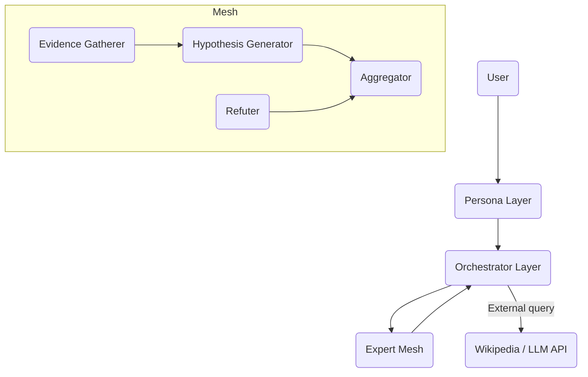

# CPU_AI_NET
## Vision

CPU_AI_NET is a distributed, CPU-friendly collective intelligence system.

Instead of building a single large GPU-based model, this project explores an alternative architecture:

- Multiple lightweight AI agents
- Structured claim-based reasoning
- Time-boxed internal deliberation
- Bayesian-style aggregation
- Persona-driven user interaction

## Architecture

## Reasoning Loop

1. Initial search
2. Task decomposition
3. Parallel claim generation
4. Refutation phase
5. Aggregation + confidence update
6. Freeze
7. Persona rewrite

## Design Principles

- GPU is optional. CPU-first architecture.
- Structured reasoning, not free-form agent chatter.
- Time-bounded internal deliberation (target ~800ms).
- Future P2P expansion (Winny-inspired claim propagation).

## Phase 1 MVP

- Single-machine prototype
- Fixed roles
- Deterministic aggregation
- No P2P yet
